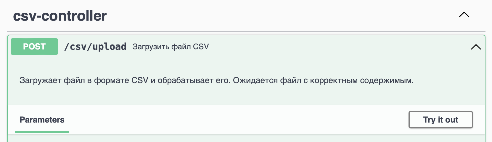

# Fulfillment API 
REST API для управления продуктами в различных центрах выполнения (Fulfillment Centers) и поддержания данных о состоянии запасов с использованием стека: Java, PostgreSQL, Spring framework, Docker
## Требования
- Docker и Docker Compose должны быть установлены на вашем компьютере.
## Установка и запуск
Следуйте этим шагам, чтобы развернуть и запустить приложение:

1. **Клонируйте репозиторий**:

   ```bash
   git clone https://github.com/StanislavShirokikh/fulfillment-api.git
   cd fulfillment-api
   
2. **Создайте Docker образы и запустите контейнеры:Выполните следующую команду, чтобы собрать Docker образы и запустить контейнеры**:
   docker-compose up --build

Если вы хотите запустить контейнеры в фоновом режиме, добавьте флаг -d:
docker-compose up -d --build

Проверьте состояние контейнеров: Убедитесь, что все контейнеры запущены и работают:
docker-compose ps

## Доступ к API
   После успешного запуска приложение будет доступно по адресу http://localhost:8081.

   Документация API доступна по адресу http://localhost:8081/fulfillment-swagger.

## Тестовые данные 
https://docs.google.com/spreadsheets/d/1rRMHjcFuDKF4WaB9t_enIijD1-vm2rY9XhOtJfnJx_A/edit?usp=sharing
1. **Экспортируйте таблицу в файл .csv**
2. **Используйте Swagger для загрузки файла** 